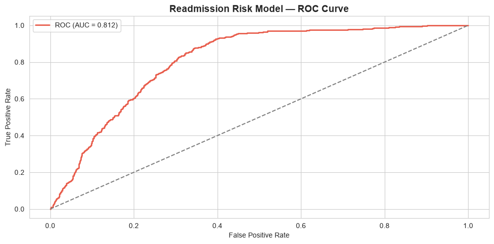
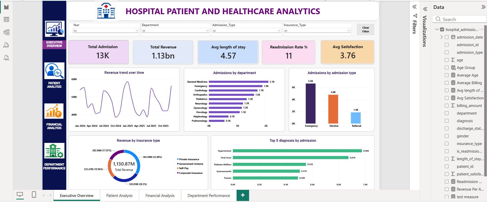
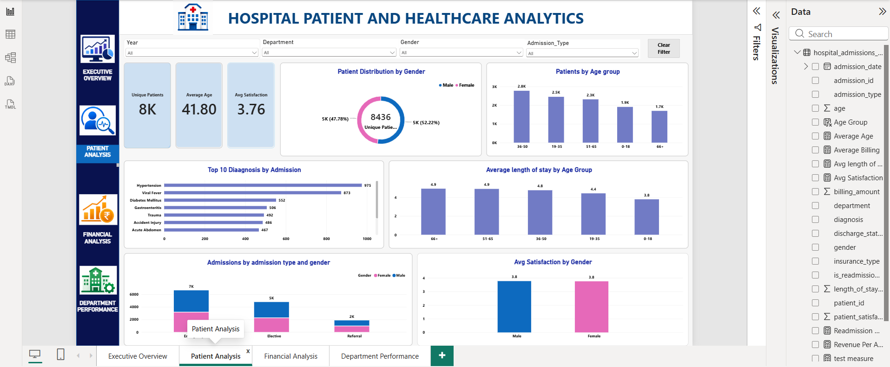
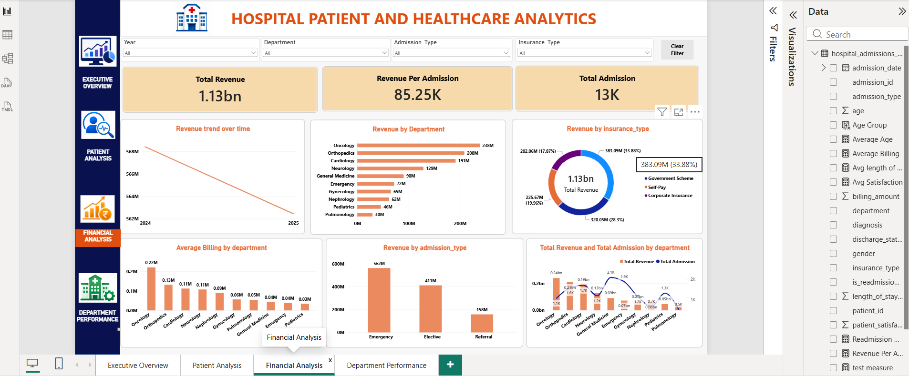
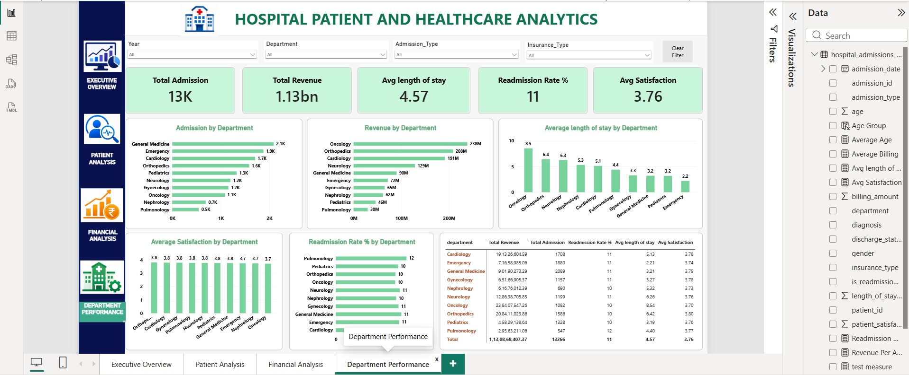

# Hospital-patient-and-healthcare-analytics
End-to-end healthcare analytics project analyzing 13K+ hospital admission records using Python, SQL, Machine Learning and Power BI. Includes data cleaning, exploratory analysis, hospital KPI analysis, financial and department insights, 30-day readmission risk prediction using Logistic Regression, and an interactive Power BI dashboard.
# 🏥 Hospital Patient & Healthcare Analytics
An end-to-end healthcare analytics project analyzing **13,266 hospital admission records** using **Python, MySQL, Machine Learning, and Power BI**.
The project focuses on hospital performance, patient demographics, admission patterns, department performance, financial trends, patient satisfaction, and **30-day readmission risk prediction**.
> ⚠️ **Dataset Disclaimer:** The dataset is synthetically generated for educational and portfolio purposes. No real patient data is used.
## 🎯 Project Objective
The project focuses on answering important healthcare business questions:
- 🏥 How is the hospital performing overall?
- 👥 What are the major patient demographic patterns?
- 💰 Which departments generate the most revenue?
- 📅 How do admissions change over time?
- 🏢 Which departments have higher admission and readmission rates?
- 🛡️ How do insurance types affect hospital activity?
- ⏱️ How does length of stay relate to patient satisfaction?
- 🤖 Can 30-day readmission risk be predicted using available patient information?
## 📊 Dataset Information
The dataset contains hospital admission records from **January 2024 to December 2025**.
| Metric | Value |
|---|---:|
| Total Admission Records | 13,266 |
| Unique Patients | 8,436 |
| Analysis Period | Jan 2024 – Dec 2025 |
| Number of Fields | 14 |
| Total Revenue | ₹113.1 Cr |
| Average Length of Stay | 4.57 days |
| 30-Day Readmission Rate | 10.60% |
| Average Patient Satisfaction | 3.76 / 5 |
### Dataset Fields
- Admission ID
- Admission Date
- Department
- Diagnosis
- Age
- Gender
- Insurance Type
- Admission Type
- Length of Stay
- Billing Amount
- Discharge Status
- 30-Day Readmission
- Patient Satisfaction
## 🛠️ Technologies Used
### 🐍 Python
- Pandas
- NumPy
- Matplotlib
- Seaborn
- Scikit-learn
- Jupyter Notebook
### 🗄️ Database
- **MySQL**
- SQL Aggregations
- GROUP BY
- ORDER BY
- CASE WHEN
- CTEs
- Window Functions
- Ranking
### 🤖 Machine Learning
- Logistic Regression
- One-Hot Encoding
- StandardScaler
- Classification
- ROC-AUC
- Precision
- Recall
- F1-Score
### 📊 Visualization & Business Intelligence
- Microsoft Power BI
- Interactive Dashboards
- KPI Analysis
- Department Analysis
- Financial Analysis
- Patient Analysis
## 🔄 Project Workflow
```text
Hospital Admission Data
          ↓
     Data Loading
          ↓
   Data Quality Checks
          ↓
 Data Cleaning & Preparation
          ↓
 Exploratory Data Analysis
          ↓
  Hospital KPI Analysis
          ↓
      MySQL Analysis
          ↓
 Machine Learning Model
          ↓
30-Day Readmission Prediction
          ↓
    Power BI Dashboard
          ↓
   Insights & Recommendations

# 1️⃣ Data Loading & Quality Checks
Python was used to load and inspect the hospital admission dataset.
### Checks performed
- Dataset shape and structure
- Column names and data types
- Missing values
- Duplicate records
- Categorical values
- Numerical distributions
- Basic statistical analysis

# 2️⃣ 🧹 Data Cleaning & Preparation
The dataset was prepared for analysis by checking data quality and preparing the required variables for exploratory analysis, MySQL analysis, machine learning, and Power BI reporting.
### Preparation included
- Missing-value checks
- Duplicate checks
- Data-type validation
- Categorical-value inspection
- Numerical-variable inspection
- Feature preparation for machine learning

# 3️⃣ 📈 Exploratory Data Analysis
The dataset was analyzed to understand:
- 👥 Patient age distribution
- ⚥ Gender distribution
- 🏢 Department-wise admissions
- 🛡️ Insurance type distribution
- 🏥 Admission types
- 🩺 Diagnosis patterns
- ⏱️ Length of stay
- 💰 Billing amounts
- ⭐ Patient satisfaction
- 🔄 30-day readmissions
- 📅 Monthly admission trends
- 🌦️ Seasonal patterns
- 🏥 Hospital KPI performance

# 4️⃣ 🗄️ MySQL Business Analysis
**MySQL** was used to perform business-oriented analysis on the hospital admission dataset.
### Analysis included
- 📊 Admission and revenue KPIs
- 📅 Monthly admission trends
- 💰 Monthly revenue trends
- 🏢 Department performance
- 🔄 Department-wise readmission rates
- 👥 Age-band analysis
- 🛡️ Insurance-type analysis
- 🏥 Discharge-status analysis
- 💰 High-cost admissions
- 📈 Revenue growth
- 🏆 Department ranking
### SQL Concepts Demonstrated
```text
SELECT
WHERE
GROUP BY
ORDER BY
Aggregate Functions
CASE WHEN
CTEs
Window Functions
RANK() OVER()
SUM() OVER()
### SQL File
The complete SQL analysis is available in:
`sql/analysis_queries.sql`
The project uses **MySQL** for database analysis.

# 5️⃣ 🤖 Machine Learning — 30-Day Readmission Prediction
A **Logistic Regression** model was developed to predict whether a patient would be readmitted within 30 days.
## 🎯 Target Variable
30-Day Readmission
## Features Used
- Age
- Length of Stay
- Billing Amount
- Department
- Insurance Type
- Admission Type
- Gender
## ⚙️ Data Preprocessing
Categorical variables were converted using:
```text
One-Hot Encoding
Numerical variables were standardized using:
```text
StandardScaler
## 🧪 Train/Test Split
The dataset was divided into training and testing sets to evaluate the performance of the machine learning model on unseen data.
| Dataset | Percentage |
|---|---:|
| Training Data | 75% |
| Testing Data | 25% |
Stratified sampling was used to maintain the class distribution between the training and testing datasets.
Because 30-day readmission is a minority class, the Logistic Regression model used:
```python
class_weight='balanced'

# 6️⃣ 📈 Model Performance
The Logistic Regression model achieved:
## **ROC-AUC: 0.81**
The model was evaluated using:
- ROC-AUC
- Precision
- Recall
- F1-Score
- Classification Report
- ROC Curve
### 📈 ROC Curve

> ⚠️ **Important:** This machine learning model is an analytical risk-screening exercise created for educational and portfolio purposes. It is not intended for clinical diagnosis, treatment decisions, or real-world patient care.

# 7️⃣ 📊 Power BI Dashboard
An interactive **Microsoft Power BI dashboard** was created to visualize the hospital analytics findings.
The dashboard contains four analytical pages:
1. Executive Overview
2. Patient Analysis
3. Financial Analysis
4. Department Performance

## 🏥 Executive Overview
The Executive Overview provides a high-level summary of hospital performance.
- Total admissions
- Total revenue
- 30-day readmission rate
- Average patient satisfaction
- Hospital performance
- Admission trends



## 👤 Patient Analysis
The Patient Analysis page focuses on patient demographics and admission patterns.
- Patient demographics
- Age groups
- Gender distribution
- Admission types
- Patient characteristics
- Readmission trends



## 💰 Financial Analysis
The Financial Analysis page focuses on hospital revenue and billing patterns.
- Total hospital revenue
- Billing amounts
- Revenue trends
- Insurance types
- Department revenue
- High-cost admissions



## 🏢 Department Performance
The Department Performance page compares hospital departments.
- Department-wise admissions
- Department revenue
- Average length of stay
- Department performance
- Readmission rates
- Revenue contribution



# 💡 Key Insights
## 1. 📅 Seasonal Admission Trends
The analysis shows noticeable changes in hospital admissions across different periods of the year.
Seasonal patterns can help with resource planning, staffing, and bed capacity planning.

## 2. 🏢 Department Performance
Different departments contribute differently to hospital admissions and revenue.
Oncology and Orthopedics generate higher revenue per admission, while General Medicine and Emergency contribute significant patient volumes.

## 3. 🔄 Readmission Patterns
Readmission rates vary across departments.
Pulmonology and General Medicine show relatively higher readmission rates in this dataset.

## 4. 🤖 Readmission Risk Prediction
The Logistic Regression model achieved a **ROC-AUC of 0.81** using patient and admission characteristics.

## 5. ⭐ Patient Satisfaction
Patient satisfaction tends to decrease among patients with longer hospital stays, particularly for stays exceeding approximately 10 days.
> These findings are based on the synthetic dataset used in this project and should not be interpreted as conclusions about real-world hospitals.

# 📌 Business Recommendations
- Monitor high-volume departments for resource planning.
- Investigate departments with higher readmission rates.
- Monitor high-cost admissions.
- Analyze length-of-stay patterns.
- Track patient satisfaction.
- Use readmission-risk prediction as an analytical screening mechanism.
- Use the Power BI dashboard for hospital KPI monitoring.

# 📁 Project Structure
```text
Hospital-patient-and-healthcare-analytics/
│
├── data/
│   └── hospital_admissions_data.csv
│
├── notebooks/
│   └── hospital_analytics.ipynb
│
├── sql/
│   └── analysis_queries.sql
│
├── powerbi/
│   └── Hospital_Healthcare_Analytics.pbix
│
├── screenshots/
│   ├── executive_overview.png
│   ├── patient_analysis.png
│   ├── financial_analysis.png
│   └── department_performance.png
│
├── outputs/
│   └── readmission_model_roc.png
│
├── README.md
├── requirements.txt
├── LICENSE
└── .gitignore

# ▶️ How to Run the Project
## 🐍 Python
Install the required libraries:
```bash
pip install -r requirements.txt
```
Open Jupyter Notebook:

```bash
jupyter notebook
```

Then open:

```text
notebooks/hospital_analytics.ipynb
```
# 🗄️ MySQL Analysis

The complete SQL analysis is available in:

```text
sql/analysis_queries.sql
```
The project uses **MySQL**, not SQLite.
The SQL analysis includes:
- Hospital KPIs
- Admission analysis
- Revenue analysis
- Department analysis
- Readmission analysis
- Insurance analysis
- Age-band analysis
- Monthly trends
- Department ranking
- Window functions
# 📊 Power BI Dashboard
The Power BI dashboard is available in:
```text
powerbi/Hospital_Healthcare_Analytics.pbix
```
Open the `.pbix` file using **Microsoft Power BI Desktop**.
The dashboard contains:
- Executive Overview
- Patient Analysis
- Financial Analysis
- Department Performance
The screenshots are included in this README to provide a visual preview of the dashboard.
# 📦 Requirements
The main Python dependencies used in this project are:
```text
pandas
numpy
matplotlib
seaborn
scikit-learn
jupyter
```
# 🚀 Future Improvements
- Compare Logistic Regression with Random Forest.
- Compare Logistic Regression with XGBoost.
- Perform hyperparameter tuning.
- Add model explainability.
- Improve model calibration.
- Develop a length-of-stay prediction model.
- Add additional hospital KPIs.
- Deploy the dashboard as a web application.
# 💼 Resume Description
### Hospital Patient & Healthcare Analytics | Python, MySQL, Machine Learning, Power BI
Built an end-to-end healthcare analytics project on **13K+ hospital admission records** using Python and MySQL; performed exploratory and business analysis, developed a **Logistic Regression model for 30-day readmission risk with ROC-AUC 0.81**, and created an interactive Power BI dashboard covering hospital KPIs, patient demographics, financial performance, department analysis, and admission trends.
# ⭐ Skills Demonstrated
## Data Analytics
- Data Cleaning
- Data Validation
- Exploratory Data Analysis
- KPI Development
- Business Analysis
- Healthcare Analytics

## Python

- Pandas
- NumPy
- Matplotlib
- Seaborn
- Jupyter Notebook

## MySQL / SQL

- MySQL
- SELECT
- WHERE
- GROUP BY
- ORDER BY
- Aggregate Functions
- CASE WHEN
- CTEs
- Window Functions
- RANK()
- SUM() OVER()

## Machine Learning

- Logistic Regression
- One-Hot Encoding
- StandardScaler
- Classification
- ROC-AUC
- Precision
- Recall
- F1-Score
- Train/Test Split
- Stratified Sampling
- Class Weight Balancing

## Business Intelligence

- Microsoft Power BI
- Interactive Dashboards
- KPI Reporting
- Financial Analysis
- Patient Analysis
- Department Analysis

# 📌 Project Highlights

| Area | Highlight |
|---|---|
| Dataset | 13,266 hospital admission records |
| Unique Patients | 8,436 |
| Database | MySQL |
| Programming | Python |
| Machine Learning | Logistic Regression |
| ML Target | 30-Day Readmission |
| Model Performance | ROC-AUC 0.81 |
| BI Tool | Power BI |
| Dashboard Pages | 4 |
| Analysis Period | Jan 2024 – Dec 2025 |
| Total Revenue | ₹113.1 Cr |
| Average Length of Stay | 4.57 days |
| Readmission Rate | 10.60% |
| Average Patient Satisfaction | 3.76 / 5 |

# ⚠️ Disclaimer
This project uses a **synthetically generated healthcare dataset** for educational and portfolio purposes.
No real patient data is used.
The analysis and machine learning model are **not intended for clinical diagnosis, treatment decisions, or real-world patient care**.

# 📄 License
This project is licensed under the **MIT License**.
